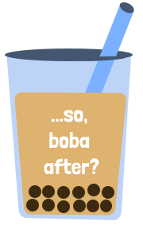

   

_Hosted at https://so-boba-after.web.app/_

A web and mobile app to track boba discounts! Currently (hyper) optimised for my friends and I to use in Waterloo, but aiming to have support for other cities.

It's fully possible this app will break as soon as more deals come out... but that's a later problem.

Built using Expo, with TypeScript, React (Native) and Firebase. Designed with Figma.

## Features List
- A list of boba deals and discounts
- Very basic sorting and filter (that currently may or not work, ymmv)
- Looking ahead to see deals on future dates
- Basic Google authentication to restrict deal adding

## Coming Soon™️
- [ ] iOS app (this is hard because I don't have an iPhone...)
- [ ] Support for other cities
- [ ] Better deals sorting and filtering (e.g. by store)
- [ ] Ability to add deals on mobile
- [ ] Tests... surely

## Commands
So I remember how to build this project:
`npx expo start` start
`npm run deploy-hosting` deploy to https://so-boba-after.web.app/
`npx expo prebuild --platform android` - prebuild for android
`eas build --profile preview --platform android` - build for android